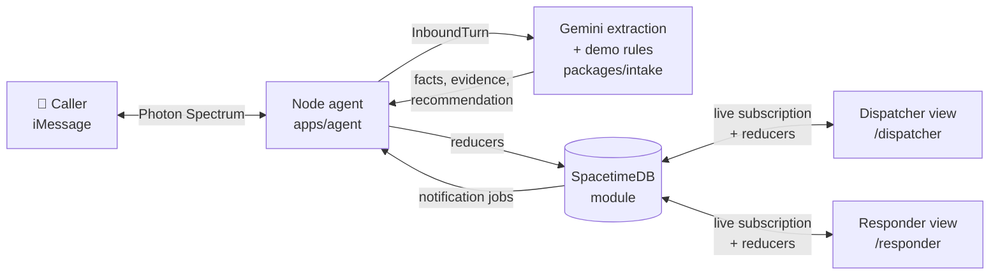

<p align="center">
  
</p>

<p align="center">
  <b>Text for help. A human dispatches. Everyone sees the same live state.</b><br>
  An incident-coordination simulation built at MHacks 2026: iMessage in, Gemini extraction, SpacetimeDB state, dispatcher and responder in the browser.
</p>

<p align="center">
  
  
  
  
  
</p>

> **Simulation only.** Flare does not contact real emergency services and gives no medical or safety guidance. Every message it sends is labelled as simulated.

## The problem

People in trouble often can't make a voice call. They text, and they text in fragments: *"I see smoke"*, then *"north entrance"*, then *"wait, south entrance, not north."* A dispatcher reading that thread has to rebuild the situation by hand, and the person who texted hears nothing until someone remembers to write back.

## What Flare does

1. **A caller sends an iMessage.** Photon Spectrum delivers it to a persistent Node agent.
2. **Gemini extracts only what the caller said.** Incident type, location, people involved, injuries, fire, trapped persons, and so on. Unknown stays `null`, not `false`. Every fact keeps the exact quote that supports it.
3. **Corrections update the same incident.** "South, not north" changes the location on the live record. It doesn't open a second case.
4. **Fixed rules suggest services. A human decides.** A deterministic rule table turns facts into recommended services (fire, EMS, police), and each suggestion carries the rule that produced it. Gemini never assigns a unit.
5. **The dispatcher confirms and assigns a unit.** The responder sees the assignment and moves it through `ACCEPTED → EN_ROUTE → ON_SCENE → COMPLETED`.
6. **The caller hears back.** Each committed status change becomes a notification job. The agent delivers it to the same iMessage thread. If the caller asks *"any update?"*, the reply is read from the database, not generated by the model.

## Architecture



SpacetimeDB is the single source of truth. Every state change goes through a reducer that checks the caller's role, so the agent, dispatcher, and responder can't step on each other. Browsers subscribe to role-filtered views and update the moment a reducer commits. No polling, no refresh.

| Layer | Path | Responsibility |
|---|---|---|
| Agent | [`apps/agent`](apps/agent) | Spectrum transport, per-conversation queue, orchestration, notification delivery with retry |
| Intake | [`packages/intake`](packages/intake) | Gemini structured extraction, fact merging, deterministic service rules |
| Contracts | [`packages/contracts`](packages/contracts) | Shared TypeScript types every package compiles against |
| Data | [`packages/data`](packages/data) | Thin adapter over generated SpacetimeDB bindings |
| Database | [`spacetime`](spacetime) | Tables, role-gated reducers, per-role views |
| Web | [`apps/web`](apps/web) | One React app with `/dispatcher` and `/responder` routes |

## Design decisions

**The model extracts. It doesn't decide.** Gemini returns structured caller facts and nothing else. Recommendations come from a fixed rule table, assignments come from a human, and lifecycle changes come from authorized reducers. A prompt-injected message can't dispatch a unit, because the model has no path to do it. Fixture [`11-instruction-injection`](fixtures/extraction/11-instruction-injection.json) covers that case.

**Unknown is different from no.** *"I don't know if anyone is hurt"* leaves `injuryReported` as `null`. The dispatcher sees what's missing, not a confident wrong answer.

**Every fact has a receipt.** Each extracted field links to the message and quoted text it came from, so a dispatcher can verify it in one glance.

**Recommended is not confirmed.** The UI keeps suggested services apart from the services a dispatcher actually confirmed, and incident status apart from assignment status.

**It survives failure.**
- Inbound messages are persisted before extraction, so a crash doesn't lose them.
- If Gemini fails, the incident shows `FAILED`, the last verified facts stay on screen, and a retry recovers to `OK`.
- Revision checks stop a slow extraction from overwriting a newer correction.
- Duplicate provider messages are ignored.
- Two dispatchers grabbing the same unit get one success and one explicit conflict.
- The agent keeps its identity and iMessage routes on disk, so after a restart it drains pending intake and unsent notifications.

**Cases don't leak.** After an incident is resolved, the next report in the same thread starts a new case epoch. The new case's Gemini prompt sees none of the old messages, facts, or questions.

## Demo (90 seconds)

| # | Action | What you see |
|---|---|---|
| 1 | Caller texts *"Simulation: I see smoke outside."* | A new incident appears with `fireOrSmoke: true` and a FIRE recommendation |
| 2 | Agent asks for the building and entrance | One question, in the iMessage thread |
| 3 | *"North entrance of the demo student center."* | Location fills in; incident moves to `READY_FOR_REVIEW` |
| 4 | *"Correction: south entrance, not north."* | Same incident, location updated, evidence quotes the correction |
| 5 | Dispatcher confirms FIRE and assigns `FIRE-01` | Incident `DISPATCHED`, unit `BUSY` |
| 6 | Responder taps Accept, then En Route | Dispatcher updates live; caller gets a simulated status text |
| 7 | *"Any update?"* | Reply built from committed assignment state |

The full script and acceptance checklist are in [docs/DEMO.md](docs/DEMO.md).

## Run it

Requires Node 22.18 or newer.

**Look at the UI without any credentials** (in-memory fixture data that follows the same rules):

```sh
npm ci --ignore-scripts --no-audit --no-fund
npm run dev -w @flare/web
# open http://localhost:5173/dispatcher and /responder
```

**Full live loop** (SpacetimeDB CLI 2.10.2, plus Gemini and Photon credentials in a root `.env`; see [`.env.example`](.env.example)):

```sh
spacetime start --listen-addr 127.0.0.1:3000 --in-memory     # separate terminal
npm run install:module && (cd spacetime && npm run publish:local)
npm run agent:terminal      # type messages as the caller
npm run agent:imessage      # or use a real iMessage thread via Photon
```

Setup for each part, including role grants and the shared Maincloud database, is in the handoffs: [agent](apps/agent/HANDOFF.md), [intake](packages/intake/HANDOFF.md), [database](spacetime/HANDOFF.md), [web](apps/web/HANDOFF.md).

## Testing

| Suite | Command | Last recorded result |
|---|---|---|
| End-to-end live smoke: role gating, live push, extraction failure and retry, rejected mutations, full assignment lifecycle, reconnect, second case | `npm run smoke:live -w @flare/web` | 40/40, three consecutive runs on local SpacetimeDB |
| Database adapter checks | `npm run check:data:live` | 64/64 |
| **Live Gemini evaluation**: 16 fixtures plus the 4-step threaded demo | `npm run eval -w @flare/intake` | **20/20** on `gemini-3.5-flash-lite`, p50 1.1 s, p95 2.6 s ([report](fixtures/results/2026-10-03T21-48-23-gemini-3.5-flash-lite.md)) |
| Extraction and rule tests (offline, canned model output) | `npm test -w @flare/intake` | all pass |
| Agent orchestration tests | `npm test -w @flare/agent` | 17/17 before the latest contract change |

The extraction suite covers 16 caller-message fixtures, including corrections, explicit negatives, uncertainty, contradictory counts, multi-message batches, and prompt injection.

## Status

Verified working:
- Live Gemini extraction: 20/20 evaluation cases, including the location correction, "I don't know" uncertainty, and prompt injection.
- The database module, role-gated reducers, and live views, against local SpacetimeDB.
- Both web routes in live mode, including real-time updates across separate identities.
- The agent's Photon cloud connection reaches the listening state.

In progress:
- The agent package needs a rebase onto the latest shared contract (`route`, `extractionState`, `caseEpoch`), so root `npm run check` currently fails in `apps/agent`.
- The shared Maincloud database and a real phone-to-dashboard round trip have not been recorded yet. The [integration board](NEXT_STEPS.md) tracks the remaining steps.

## Team

Four people, ten hours.

| | Workstream | Guide |
|---|---|---|
| Person 1 | Photon Spectrum, Node agent, integration | [role guide](docs/roles/person-1-photon-integration.md) |
| Person 2 | Gemini extraction, rules, fixtures, demo | [role guide](docs/roles/person-2-gemini-extraction.md) |
| Person 3 | SpacetimeDB, shared contract, data adapter | [role guide](docs/roles/person-3-spacetimedb.md) |
| Person 4 | Dispatcher and responder web app | [role guide](docs/roles/person-4-web-app.md) |

Contributors start with [handoff.md](handoff.md), the [integration contract](docs/CONTRACT.md), and [CLAUDE.md](CLAUDE.md).
